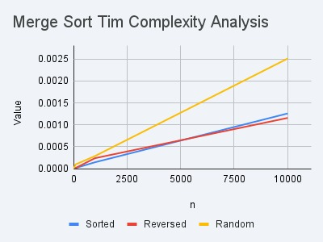

# LAB 3

1. Find out the time complexity of **Binary Search**.
2. Find out the time complexity of **Ternary Search**.
3. Find out the best, worst and average case time complexity of **Merge Sort**.

---

|n|	Sorted |Reversed|Random|
|---|---|---|---|
|10|	0.000001|	0.000003|	0.000002|
|100|	0.000013|	0.000014|	0.000096|
|1000|	0.000144|	0.000237|	0.000285|
|10000|	0.001258|	0.001156|	0.002511|

