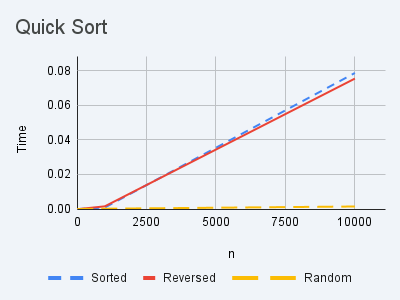

# LAB 4

1. Perform quicksort.

|n|	Sorted|	Reversed|	Random|
|---|---|---|---|
|10|	0.000003|	0.000003|	0.000002|
|100|	0.000025|	0.000029|	0.000015|
|1000|	0.00084|	0.001538|	0.000164|
|10000|	0.078653|	0.075414|	0.001454|

